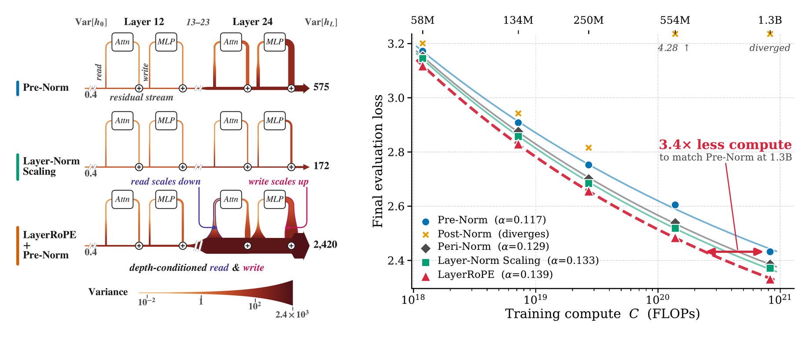

<!-- TODO: point this badge at the LayerRoPE modded-nanogpt record -->
<p align="right"><a href="https://github.com/KellerJordan/modded-nanogpt"></a></p>

<div align="center">

# LayerRoPE

### Dynamic Depth-wise Magnitude & Angular Superposition

[Shikhar Srivastava](https://www.cs.rochester.edu/u/ssrivas9/) &nbsp;·&nbsp; [Christopher Kanan](http://chriskanan.com)<br>
University of Rochester

*Under review* &nbsp;·&nbsp; *Actionable Interpretability Workshop @ CoLM 2026*

<a href="https://arxiv.org/abs/2610.09179"></a>&nbsp;
<a href="https://www.cs.rochester.edu/u/ssrivas9/layer-rope/"></a>

<a href="https://github.com/shikhar-srivastava/parcae-layerrope"></a>&nbsp;
<a href="https://github.com/shikhar-srivastava/deit-layerrope"></a>

<br>



<sub><b>Left:</b> LayerRoPE conditions each block's read and write gains on depth while maximizing residual variance. <b>Right:</b> compute scaling on a 4× Chinchilla model ladder; LayerRoPE matches Pre-Norm's 1.3B loss with 3.4× less compute.</sub>

</div>

<br>

Code for the model-ladder and depth-scaling experiments of the paper.

LayerRoPE replaces the per-layer normalization gains with one shared gain $\gamma$ per site (the input and output of the attention and MLP blocks), scaled and rotated by a depth-conditioned complex factor:

```math
\begin{gathered}
\gamma_\ell = \gamma \odot_c \exp\big(r(\ell) + i\,\theta(\ell, j)\big), \\
r(\ell) = \alpha + \beta \log(\ell + 1), \qquad \theta(\ell, j) = \exp\big(\alpha_{\mathrm{rot}} + \beta_{\mathrm{rot}} \log(\ell + 1)\big)\, b^{-2j/d}
\end{gathered}
```

where $\odot_c$ multiplies the pairs $(\gamma_{2j}, \gamma_{2j+1})$ as complex numbers. The method is the `LayerRoPE` class in [`peft_pretraining/modeling_llama.py`](peft_pretraining/modeling_llama.py). This repository is built on [LayerNorm-Scaling](https://github.com/lmsdss/LayerNorm-Scaling). The looped-model and ViT experiments are in our forks of [Parcae](https://github.com/shikhar-srivastava/parcae-layerrope) and [DeiT](https://github.com/shikhar-srivastava/deit-layerrope).

## Setup

```bash
conda create -n layerrope python=3.10 -y && conda activate layerrope
pip install -r requirements.txt
huggingface-cli login   # for the meta-llama/Llama-2-7b-hf tokenizer
wandb login
```

## Model ladder

```bash
bash run_130m.sh pre              # Pre-Norm
bash run_130m.sh post             # Post-Norm
bash run_130m.sh peri             # Peri-Norm
bash run_130m.sh lns              # LayerNorm Scaling
bash run_130m.sh layerrope        # LayerRoPE (on Pre-Norm)
bash run_130m.sh layerrope_peri   # LayerRoPE on Peri-Norm
```

`run_60m.sh`, `run_250m.sh`, `run_500m.sh` and `run_1b.sh` take the same methods. Each method runs at its tuned peak learning rate<sup>†</sup>:

| Model | Pre    | Post     | Peri   | LNS    | LayerRoPE | LayerRoPE + Peri |
|:------|:------:|:--------:|:------:|:------:|:---------:|:----------------:|
| 60M   | 1.6e-2 | 2e-3     | 3.2e-2 | 1.6e-2 | 6.4e-2    | 6.4e-2           |
| 130M  | 8e-3   | 2e-3     | 8e-3   | 1.6e-2 | 3.2e-2    | 3.2e-2           |
| 250M  | 8e-3   | 1e-3     | 1.6e-2 | 1.6e-2 | 6.4e-2    | 3.2e-2           |
| 500M  | 4e-3   | 6.25e-5  | 1.6e-2 | 8e-3   | 3.2e-2    | 8e-3             |
| 1B    | 2e-3   | 3.125e-5 | 8e-3   | 8e-3   | 3.2e-2    | 4e-3             |

<sub><sup>†</sup> See the model-ladder learning-rate sweeps in Appendix D.1.2 of the [paper](https://arxiv.org/abs/2610.09179) for details.</sub>

Set the learning rate with `--lr` (e.g. for the learning-rate sweeps) and the seed with `--seed`; any other argument is passed on to `torchrun_main.py`:

```bash
bash run_130m.sh layerrope --lr 1.6e-2 --seed 2 --layerrope_beta_init -1.0
```

The scripts train on 4 GPUs (8 for 1B; set `NGPU`) with a total batch of 512 sequences of 256 tokens; `--batch_size` sets the per-GPU micro-batch.

## Depth scaling

```bash
for L in 48 96 192 256 384 512; do bash run_depth.sh layerrope $L; done
bash run_depth.sh deepnet 256 --deepnet_depth_alpha   # depth-corrected DeepNet
```

The methods are `pre`, `post`, `peri`, `lns`, `deepnet` and `layerrope`, at a shared learning rate of 1e-3 (`--lr` for the per-depth sweep). DeepNet is LayerNorm-Scaling's implementation, which scales the residual by a fixed $\alpha = (2 \cdot 32)^{1/4}$, DeepNet's value for 32 layers; we correct its initialization gain to DeepNet's $(8L)^{-1/4}$ (LayerNorm-Scaling uses $(8L)^{1/4}$). We also include a depth-corrected DeepNet, with $\alpha = (2L)^{1/4}$ for $L$ layers, set with `--deepnet_depth_alpha`; our per-depth sweep used it.

## LayerRoPE options

| Flag | Default | Parameter |
|:-----|:-------:|:----------|
| `--layerrope_alpha_init`     | 0    | $\alpha$ |
| `--layerrope_beta_init`      | −0.5 | $\beta$, the magnitude depth slope |
| `--layerrope_alpha_rot_init` | 0    | $\alpha_{\mathrm{rot}}$ |
| `--layerrope_beta_rot_init`  | −0.5 | $\beta_{\mathrm{rot}}$, the rotation depth slope |
| `--layerrope_base_freq`      | 100  | $b$ |

The defaults are the model-ladder configuration; `run_depth.sh` uses $\beta = \beta_{\mathrm{rot}} = 0$ and $b = 10^4$. For a new setting, it suffices to try $\beta, \beta_{\mathrm{rot}} \in \lbrace -0.5, 0 \rbrace$ and $b \in \lbrace 10^2, 10^4 \rbrace$; no further tuning is needed.

## Notes

- **Precision.** `--rmsnorm_fp32` keeps every normalization gain (RMSNorm weights and LayerRoPE's parameters) in fp32. We used it in all experiments here to avoid bf16 precision issues, given how much the norm gains matter across methods. Disable it with `--no-rmsnorm_fp32`; our ViT and Parcae experiments, for instance, ran without it.
- **1B.** The 1B runs take 1.15 passes over C4 (`--multi_epoch`) and use fp32 output logits from the start. Our original 1B runs switched to fp32 logits midway through training, from a checkpoint (see Appendix D.1).
- **Losses.** `eval_loss` (the model's own output head) and `eval_loss_fp32` (fp32 output logits) are means over a fixed 10M-token sample of C4 validation. The paper's model-ladder figures report `eval_loss_fp32`, its depth-scaling figures `eval_loss`.
- **Data.** C4 is streamed. Our runs read a local copy instead: to reproduce their exact data order, pass `--c4_cache_dir DIR` (C4 is downloaded there once) and keep the scripts' GPU count and per-GPU batch.
- **Depth runs** use the upstream LayerNorm-Scaling data loader (`--legacy_dataloader`), as ours did; see [`peft_pretraining/dataloader.py`](peft_pretraining/dataloader.py).
- **Resume** by rerunning the same command with `--continue_from checkpoints/<run>/model_<step>`.
- **Embedding init** has standard deviation $\sqrt{2/5}$, as in the original LayerNorm-Scaling code (upstream now uses 0.02).

## Citation

```bibtex
@misc{srivastava2026layerrope,
  title         = {LayerRoPE: Dynamic Depth-wise Magnitude \& Angular Superposition},
  author        = {Srivastava, Shikhar and Kanan, Christopher},
  year          = {2026},
  eprint        = {2610.09179},
  archivePrefix = {arXiv},
  url           = {https://arxiv.org/abs/2610.09179}
}
```

## Acknowledgement

This repository builds on [LayerNorm-Scaling](https://github.com/lmsdss/LayerNorm-Scaling), [GaLore](https://github.com/jiaweizzhao/GaLore) and [Mix-LN](https://github.com/pixeli99/MixLN).
